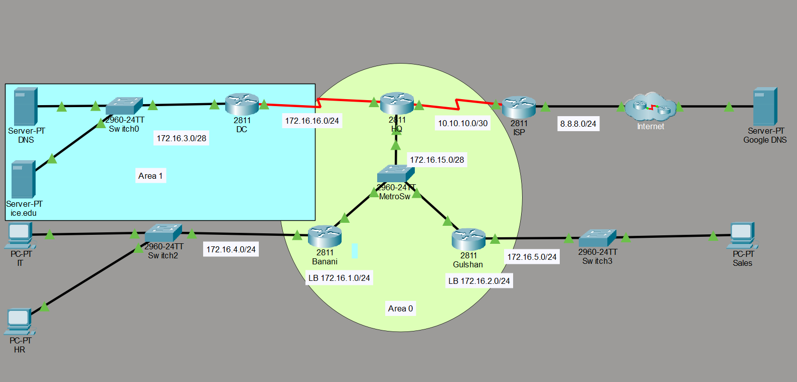

# Multi-Area OSPF Enterprise Network with Internet Connectivity

## 📌 Project Overview

This project demonstrates the design and implementation of a **Multi-Area OSPF enterprise network** using Cisco Packet Tracer.

The network is divided into two OSPF areas:

- **Area 0 — Backbone Area**
- **Area 1 — Data Center Area**

The **HQ router acts as the Area Border Router (ABR)** between Area 0 and Area 1.

The project also demonstrates:

- Multi-Area OSPF routing
- OSPF neighbor formation
- OSPF DR/BDR election
- Manual OSPF Router IDs
- Loopback interface advertisement
- Inter-area route propagation
- Static default routing
- Default route advertisement through OSPF
- ISP connectivity
- Standard and Extended ACLs
- OSPF hello/dead timer modification
- Telnet access restriction
- End-to-end connectivity testing

All internal PCs can successfully reach the simulated external `8.8.8.0/24` network.

---

## 🖼️ Network Topology

The following screenshot shows the complete Cisco Packet Tracer topology used in this project.



The topology contains:

- HQ Router
- Banani Router
- Gulshan Router
- Data Center Router
- ISP Router
- DNS Server
- `ice.edu` Server
- IT PC
- HR PC
- Sales PC
- Simulated external Google DNS network

---

# 🏗️ Network Architecture

## Area 0 — Backbone Area

Area 0 contains:

- HQ Router
- Banani Router
- Gulshan Router
- Banani LAN
- Gulshan LAN
- Banani Loopback
- Gulshan Loopback

The three routers communicate through the shared Ethernet network:

```text
172.16.15.0/28
```

## Area 1 — Data Center Area

Area 1 contains:

- HQ Router
- DC Router
- Data Center LAN

HQ and DC communicate through:

```text
172.16.16.0/24
```

The Data Center LAN uses:

```text
172.16.3.0/28
```

Because HQ has one OSPF interface in Area 0 and another in Area 1, it operates as the **Area Border Router (ABR)**.

---

# 🔀 Logical Topology

```text
                         AREA 1
                 ┌─────────────────────┐
                 │                     │
                 │   172.16.3.0/28    │
                 │         |           │
                 │        DC           │
                 │         |           │
                 │  172.16.16.0/24    │
                 │         |           │
                 └─────────|───────────┘
                           |
                          HQ
                     Area 0 / Area 1
                          ABR
                           |
                    172.16.15.0/28
                    /             \
                   /               \
              Banani              Gulshan
                |                    |
        172.16.4.0/24        172.16.5.0/24
                |                    |
             IT / HR               Sales

              Loopback             Loopback
             172.16.1.1           172.16.2.1

                          HQ
                           |
                    10.10.10.0/30
                           |
                          ISP
                           |
                      8.8.8.0/24
                           |
                   Simulated Internet
```

---

# 🌐 IP Addressing Scheme

## Router Interfaces

| Device | Interface | IP Address | Subnet Mask | Purpose |
|---|---|---:|---:|---|
| HQ | FastEthernet0/0 | 172.16.15.1 | 255.255.255.240 | Area 0 shared segment |
| HQ | Serial0/3/0 | 172.16.16.1 | 255.255.255.0 | HQ-to-DC |
| HQ | Serial0/3/1 | 10.10.10.1 | 255.255.255.252 | HQ-to-ISP |
| Banani | FastEthernet0/0 | 172.16.15.2 | 255.255.255.240 | Area 0 shared segment |
| Banani | FastEthernet0/1 | 172.16.4.1 | 255.255.255.0 | Banani LAN gateway |
| Banani | Loopback1 | 172.16.1.1 | 255.255.255.0 | Loopback |
| Gulshan | FastEthernet0/0 | 172.16.15.3 | 255.255.255.240 | Area 0 shared segment |
| Gulshan | FastEthernet0/1 | 172.16.5.1 | 255.255.255.0 | Gulshan LAN gateway |
| Gulshan | Loopback2 | 172.16.2.1 | 255.255.255.0 | Loopback |
| DC | FastEthernet0/0 | 172.16.3.1 | 255.255.255.240 | Data Center LAN gateway |
| DC | Serial0/3/0 | 172.16.16.2 | 255.255.255.0 | DC-to-HQ |
| ISP | Serial0/3/0 | 10.10.10.2 | 255.255.255.252 | ISP-to-HQ |
| ISP | FastEthernet0/0 | 8.8.8.1 | 255.255.255.0 | Simulated external network |

---

# 📋 Network Summary

| Network | Prefix | Purpose |
|---|---|---|
| 172.16.1.0 | /24 | Banani Loopback |
| 172.16.2.0 | /24 | Gulshan Loopback |
| 172.16.3.0 | /28 | Data Center LAN — Area 1 |
| 172.16.4.0 | /24 | Banani LAN — Area 0 |
| 172.16.5.0 | /24 | Gulshan LAN — Area 0 |
| 172.16.15.0 | /28 | HQ-Banani-Gulshan OSPF segment |
| 172.16.16.0 | /24 | HQ-DC link — Area 1 |
| 10.10.10.0 | /30 | HQ-to-ISP WAN |
| 8.8.8.0 | /24 | Simulated external network |

---

# ⚙️ OSPF Configuration

The OSPF process ID used in the internal routing domain is:

```cisco
router ospf 1
```

---

## 🏢 HQ Router

HQ performs three major roles:

1. Backbone router
2. Area Border Router between Area 0 and Area 1
3. Gateway toward the ISP

### OSPF Configuration

```cisco
router ospf 1
 router-id 1.1.1.1
 log-adjacency-changes
 network 172.16.15.0 0.0.0.15 area 0
 network 172.16.16.0 0.0.0.255 area 1
 default-information originate
```

---

## 🏙️ Banani Router

Banani belongs to Area 0.

```cisco
router ospf 1
 router-id 2.2.2.2
 log-adjacency-changes
 network 172.16.1.0 0.0.0.255 area 0
 network 172.16.4.0 0.0.0.255 area 0
 network 172.16.15.0 0.0.0.15 area 0
```

Banani advertises:

- `172.16.1.0/24` loopback network
- `172.16.4.0/24` LAN
- `172.16.15.0/28` shared OSPF segment

---

## 🏙️ Gulshan Router

Gulshan also belongs to Area 0.

```cisco
router ospf 1
 router-id 3.3.3.3
 log-adjacency-changes
 network 172.16.2.0 0.0.0.255 area 0
 network 172.16.5.0 0.0.0.255 area 0
 network 172.16.15.0 0.0.0.15 area 0
```

Gulshan advertises:

- `172.16.2.0/24` loopback network
- `172.16.5.0/24` LAN
- `172.16.15.0/28` shared OSPF segment

---

## 🗄️ Data Center Router

The DC router belongs to Area 1.

```cisco
router ospf 1
 log-adjacency-changes
 network 172.16.3.0 0.0.0.15 area 1
 network 172.16.16.0 0.0.0.255 area 1
```

---

# 🆔 OSPF Router IDs

| Router | Router ID |
|---|---|
| HQ | 1.1.1.1 |
| Banani | 2.2.2.2 |
| Gulshan | 3.3.3.3 |
| DC | Dynamically selected as 172.16.16.2 |

HQ, Banani, and Gulshan use manually configured OSPF Router IDs.

The DC router does not have a manually configured Router ID, so OSPF selected `172.16.16.2`.

---

# 🗳️ OSPF DR and BDR Election

HQ, Banani, and Gulshan share the Ethernet broadcast segment:

```text
172.16.15.0/28
```

The configured OSPF priorities are:

| Router | OSPF Priority | OSPF Role |
|---|---:|---|
| HQ | 100 | DR |
| Banani | 80 | BDR |
| Gulshan | 60 | DROTHER |

### HQ

```cisco
interface FastEthernet0/0
 ip ospf priority 100
```

### Banani

```cisco
interface FastEthernet0/0
 ip ospf priority 80
```

### Gulshan

```cisco
interface FastEthernet0/0
 ip ospf priority 60
```

The neighbor tables confirm the election:

```text
HQ      → DR
Banani  → BDR
Gulshan → DROTHER
```

---

# 🔁 Loopback Interfaces

Loopback interfaces are configured on Banani and Gulshan.

## Banani

```cisco
interface Loopback1
 ip address 172.16.1.1 255.255.255.0
```

## Gulshan

```cisco
interface Loopback2
 ip address 172.16.2.1 255.255.255.0
```

Although the interfaces are configured with `/24` masks, OSPF advertises normal loopback interfaces as `/32` host routes by default.

Examples from the routing tables:

```text
O 172.16.1.1/32
O 172.16.2.1/32
```

---

# ⏱️ OSPF Hello and Dead Timers

The serial link between HQ and DC uses customized OSPF timers.

```text
Hello Interval = 20 seconds
Dead Interval  = 80 seconds
```

### HQ

```cisco
interface Serial0/3/0
 ip ospf hello-interval 20
 ip ospf dead-interval 80
```

### DC

```cisco
interface Serial0/3/0
 ip ospf hello-interval 20
 ip ospf dead-interval 80
```

The hello and dead intervals must match on both sides for OSPF adjacency to form.

---

# 🔗 OSPF Neighbor Relationships

## HQ

HQ forms OSPF adjacencies with:

- Banani
- Gulshan
- DC

Example:

```text
Neighbor ID     Pri   State
2.2.2.2          80   FULL/BDR
3.3.3.3          60   FULL/DROTHER
172.16.16.2       0   FULL/-
```

## Banani

Banani forms adjacencies with:

- HQ
- Gulshan

## Gulshan

Gulshan forms adjacencies with:

- HQ
- Banani

## DC

DC forms an adjacency with:

- HQ

---

# 🌍 Internet Connectivity

HQ connects the enterprise network to the simulated ISP using:

```text
10.10.10.0/30
```

| Device | IP Address |
|---|---|
| HQ | 10.10.10.1/30 |
| ISP | 10.10.10.2/30 |

---

# 🛣️ Default Static Route

HQ uses a static default route pointing to the ISP.

```cisco
ip route 0.0.0.0 0.0.0.0 10.10.10.2
```

HQ's routing table therefore contains:

```text
S* 0.0.0.0/0 via 10.10.10.2
```

---

# 📢 Advertising the Default Route into OSPF

HQ advertises the default route into OSPF using:

```cisco
router ospf 1
 default-information originate
```

The other OSPF routers learn the route as an **OSPF External Type 2 default route**:

```text
O*E2 0.0.0.0/0
```

Examples:

### Banani

```text
O*E2 0.0.0.0/0 via 172.16.15.1
```

### Gulshan

```text
O*E2 0.0.0.0/0 via 172.16.15.1
```

### DC

```text
O*E2 0.0.0.0/0 via 172.16.16.1
```

---

# ↩️ ISP Return Route

The ISP has a static return route toward the internal network:

```cisco
ip route 172.16.0.0 255.240.0.0 10.10.10.1
```

This allows response traffic from the simulated external network to return through HQ.

> **Note:** The configured mask `255.240.0.0` represents `/12`, so the route covers the full `172.16.0.0/12` private address block.

---

# 🔄 End-to-End Packet Flow

When an internal PC sends traffic to `8.8.8.8`:

```text
PC
 ↓
Local Default Gateway
 ↓
OSPF Router
 ↓
HQ
 ↓
Default Static Route
 ↓
ISP
 ↓
8.8.8.0/24 Network
```

Return traffic follows:

```text
8.8.8.0/24 Network
 ↓
ISP
 ↓
Static Return Route
 ↓
HQ
 ↓
OSPF
 ↓
Destination Branch
 ↓
PC
```

All PCs in the completed topology can successfully ping `8.8.8.8`.

---

# ℹ️ Why NAT Is Not Required in This Lab

This Packet Tracer topology uses a **simulated Internet environment**.

NAT is not configured.

Connectivity still works because the ISP router has a static route back toward the internal `172.16.0.0/12` address space.

In a real Internet environment, RFC1918 private addresses such as `172.16.x.x` are normally translated using NAT/PAT before accessing the public Internet.

---

# 🔐 Access Control Lists

The project also demonstrates Standard and Extended ACLs.

---

## Standard ACL on the Data Center Router

```cisco
access-list 10 deny host 172.16.4.3
access-list 10 permit any
```

Applied outbound:

```cisco
interface FastEthernet0/0
 ip access-group 10 out
```

This blocks traffic sourced from `172.16.4.3` from leaving the DC router through FastEthernet0/0 while permitting other traffic.

---

# 🚫 Extended ACL on Gulshan

```cisco
access-list 100 deny tcp host 172.16.5.2 host 172.16.3.3 eq www
access-list 100 deny icmp host 172.16.5.2 host 172.16.3.3
access-list 100 permit ip any any
```

Applied inbound:

```cisco
interface FastEthernet0/1
 ip access-group 100 in
```

This prevents host `172.16.5.2` from:

- Accessing HTTP on `172.16.3.3`
- Pinging `172.16.3.3`

Other IP traffic is permitted.

---

# 🔒 Remote Access Restriction on Banani

Banani uses a named standard ACL to restrict VTY access:

```cisco
ip access-list standard ResRemoteLog
 permit host 172.16.4.2
```

Applied to the VTY lines:

```cisco
line vty 0 4
 access-class ResRemoteLog in
 login
 transport input telnet
```

Only the permitted host can initiate the configured Telnet session to Banani.

> **Security Note:** Telnet is used here only for lab practice. SSH is preferred in production because Telnet does not encrypt traffic. The lab password is intentionally not published in this README.

---

# 📚 Routing Table Codes Demonstrated

| Code | Meaning |
|---|---|
| `C` | Connected route |
| `L` | Local interface route |
| `O` | OSPF intra-area route |
| `O IA` | OSPF inter-area route |
| `O*E2` | OSPF external Type 2 default route |
| `S*` | Static candidate default route |

Example of an inter-area route on Banani:

```text
O IA 172.16.3.0/28 via 172.16.15.1
```

Example of the external default route:

```text
O*E2 0.0.0.0/0 via 172.16.15.1
```

---

# 🧪 Verification Commands

## Check Interface Status

```cisco
show ip interface brief
```

## Check OSPF Neighbors

```cisco
show ip ospf neighbor
```

## Check Routing Table

```cisco
show ip route
```

## Check OSPF Routes

```cisco
show ip route ospf
```

## Check Routing Protocol Information

```cisco
show ip protocols
```

## Check OSPF Interface Information

```cisco
show ip ospf interface
```

## Check OSPF Process Information

```cisco
show ip ospf
```

## Connectivity Test

```cisco
ping 8.8.8.8
```

A successful ping confirms end-to-end connectivity through:

```text
LAN → OSPF → HQ → ISP → Simulated External Network
```

---

# ✅ Project Verification

- [x] OSPF process configuration
- [x] OSPF Area 0
- [x] OSPF Area 1
- [x] Multi-Area OSPF communication
- [x] HQ acting as ABR
- [x] OSPF neighbor adjacencies
- [x] DR/BDR election
- [x] Manual Router IDs
- [x] OSPF priority configuration
- [x] Loopback advertisement
- [x] Intra-area routing
- [x] Inter-area routing
- [x] Customized OSPF hello/dead timers
- [x] Static default route
- [x] Default route advertisement through OSPF
- [x] ISP return routing
- [x] Standard ACL
- [x] Extended ACL
- [x] Restricted VTY access
- [x] End-to-end LAN connectivity
- [x] Connectivity to simulated `8.8.8.8`

---

# 🎯 Key Concepts Demonstrated

### OSPF

- OSPFv2
- Process IDs
- Router IDs
- Network statements
- Wildcard masks
- Neighbor relationships
- Link-state routing

### Multi-Area OSPF

- Backbone Area 0
- Area 1
- Area Border Router
- Intra-area routes
- Inter-area routes

### OSPF Election

- Designated Router
- Backup Designated Router
- DROTHER
- OSPF interface priority

### Routing

- Connected routes
- Local routes
- Dynamic routes
- Static routes
- Default routes
- External OSPF routes

### Security

- Standard ACL
- Extended ACL
- VTY access restriction

### WAN / ISP Connectivity

- Point-to-point WAN addressing
- Static default route
- OSPF default-route propagation
- ISP return route
- Simulated Internet connectivity

---

# 📂 Suggested Repository Structure

```text
cisco-packet-tracer-multiarea-ospf/
│
├── README.md
├── OSPF-Multi-Area.pkt
│
├── configs/
│   ├── HQ.txt
│   ├── Banani.txt
│   ├── Gulshan.txt
│   ├── DC.txt
│   └── ISP.txt
│
└── screenshots/
    ├── topology.png
    ├── ospf-neighbors.png
    ├── routing-table.png
    ├── ping-8.8.8.8.png
    ├── acl-verification.png
    └── dr-bdr-election.png
```

### Adding Screenshots to GitHub

1. Create a folder named `screenshots` inside the repository.
2. Upload the image files to that folder.
3. Use Markdown like this inside `README.md`:

```markdown

```

For example:

```markdown

```

GitHub will automatically display the image inside the README as long as the path and filename are correct.

---

# 🚀 How to Run the Project

1. Install **Cisco Packet Tracer**.
2. Clone or download this repository.
3. Open the `.pkt` topology file.
4. Allow OSPF to converge.
5. Run `show ip ospf neighbor` on the routers.
6. Run `show ip route` to inspect learned routes.
7. Test connectivity between internal networks.
8. Ping `8.8.8.8` from the internal PCs.
9. Test the configured ACL restrictions.

---

# 🧠 What I Learned

Through this project, I practiced how OSPF works in a multi-area environment.

I learned how the OSPF backbone area connects to another area through an Area Border Router and how routers in different areas exchange routes.

I also gained practical experience with:

- OSPF Router IDs
- DR/BDR elections
- OSPF priorities
- Loopback advertisements
- OSPF neighbor relationships
- OSPF hello/dead timers
- Static default routing
- Default route propagation
- Standard and Extended ACLs
- ISP return routing
- Routing-table verification

---

# 🛠️ Technologies Used

- Cisco Packet Tracer
- Cisco IOS
- OSPFv2
- IPv4
- Static Routing
- Standard ACL
- Extended ACL
- Ethernet
- Serial WAN Links

---

# 📖 Project Type

**Networking Lab / CCNA Practice / Portfolio Project**

This project was created for hands-on practice with enterprise routing concepts and can be used as part of a networking portfolio.

---

## 👤 Author

**K M Mazharul Haque**
